

## Overview ##

In this lab, you will learn how to configure continuous integration (CI) and continuous deployment (CD) for your applications using Build and Release in Azure Pipelines. This scriptable CI/CD system is both web-based and cross-platform, while also providing a modern interface for visualizing sophisticated workflows. Although we won't demonstrate all of the cross-platform possibilities in this lab, it is important to point out that you can also build for iOS, Android, Java (using Ant, Maven, or Gradle) and Linux.

Want additional learning? Check out the <a href="https://docs.microsoft.com/en-us/learn/modules/create-a-build-pipeline/" target="_blank"><b><u> Create a build pipeline with Azure Pipelines </u></b></a> module on Microsoft Learn.

### Prerequisites ###

- This lab requires you to complete task 1 from the <a href="../prereq/">prerequisite</a> instructions.

## Exercise 1: Introduction to Azure DevOps Build ##

### Task 1: Creating a basic build pipeline from a template ###

1. Navigate to your team project on Azure DevOps.

1. Navigate to **Pipelines \| Pipelines**.

    

1. Open (click) the existing **PartsUnlimited** pipeline (which was created by the demo generator tool) and click on **Edit**

    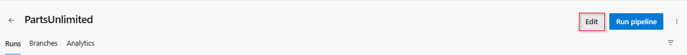

1. Not to have two pipelines triggered later in the lab, disable the CI trigger for the template created, by navigating to the triggeres section of the pipeline, enable the checkbox to override the current trigger option and **Save**.

    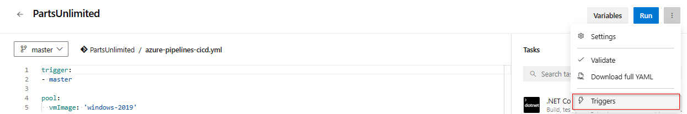

    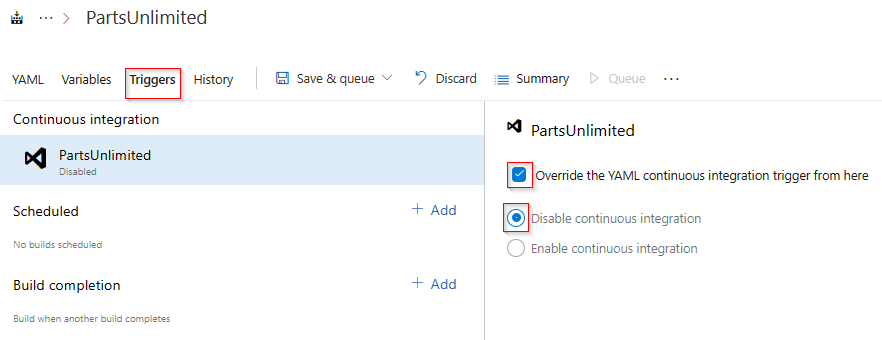
 
1. Navigate back to **Pipelines \| Pipelines** and click **New pipeline** to create a new build pipeline.

    

1. The default option for build pipelines involves using YAML to define the process.

    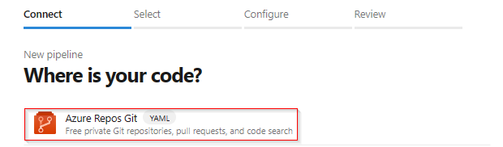

1. The first thing you'll need to do is to configure the source repository. Every major platform is available, but the default options are all we need here. This build will use the **master** branch of the **PartsUnlimited** repo.

    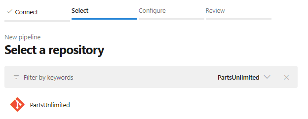

1. Configure the pipeline with the existing YAML file. Click **Existing Azure Pipelines YAML file**.

    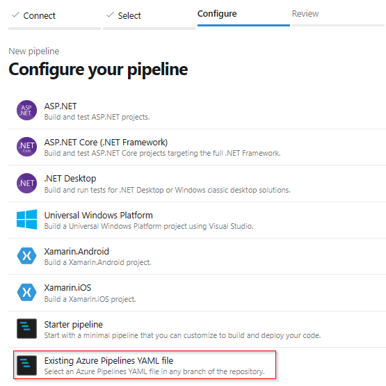

1. Choose the YAML file path from the **master** branch of the PartsUnlimited repo. Click **Continue**.

    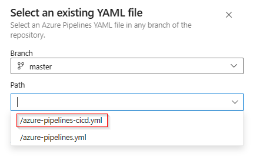

1. Review the YAML file and click **Save** or **Run** the pipeline. 

    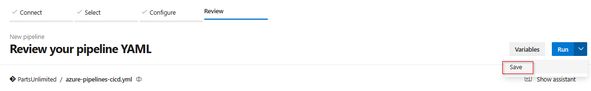

    > **Note:** The YAML file contains the deployment script, which helps to deploy the application to Azure App Service. This needs to be updated with the correct Azure Subscription and App Service Name. This will be converd in the next lab.

1. Continious Integration trigger will be enabled for the pipeline, click on **Run** to trigger the build. Refer to the document for more details on [YAML Pipeline Triggers](https://learn.microsoft.com/en-us/azure/devops/pipelines/build/triggers?view=azure-devops#branch-consideration-for-triggers-in-yaml-pipelines).

### Task 2: Tracking and reviewing a build ###

1. Depending on load, the build may need to wait in the queue for a moment.

    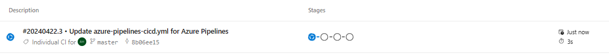

1. Once the build begins, you'll be able to track the console output per task. Click **Agent job 1**.

    

1. If you want to review an earlier task, you can scroll the right pane to review its logs.
    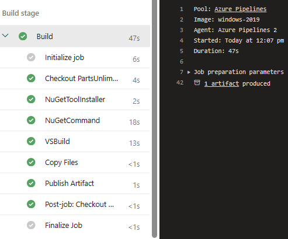
1. The build should eventually succeed. You can return to the summary view by clicking the back button.

    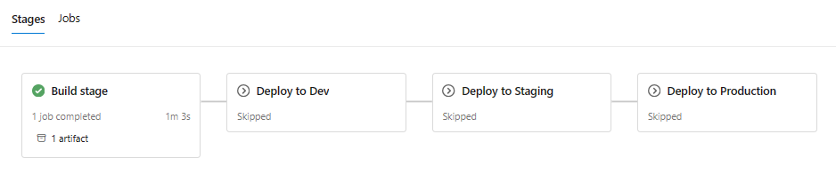

1. The summary view provides overview details about the build, including details about commits, tests, and artifacts.

    

### Task 3: Invoking a continuous integration build ###

1. The build was configured earlier to support continuous integration. Navigate to the code for this project using **Repos \| Files**.

    

1. Open the file at **PartsUnlimited-aspnet45/src/PartsUnlimitedWebsite/Views/Home/Index.cshtml**.

    

1. Click **Edit**.

    

1. Make a minor cosmetic change, such as by tweaking the title of the document. Click **Commit**.

    

1. Accept the default commit details and click **Commit**.

    

1. A build should be underway shortly. Select **Pipelines \| Pipelines** to see if it's in progress.

    

1. This build should run and succeed just like the previous build, and waiting for permission to continue with the next stages to deploy the application.

    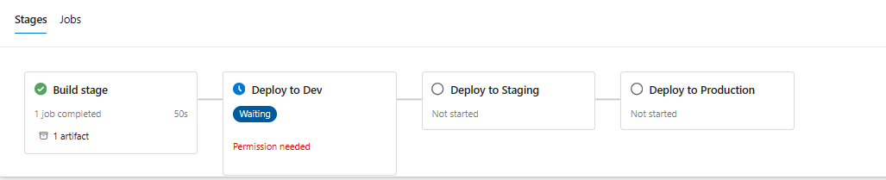

Follow the instructions in the next exercise to deploy the application to Azure App Service using <a href="../continuousdeployment/"> Continuous Deployment with Azure Pipelines</a>.