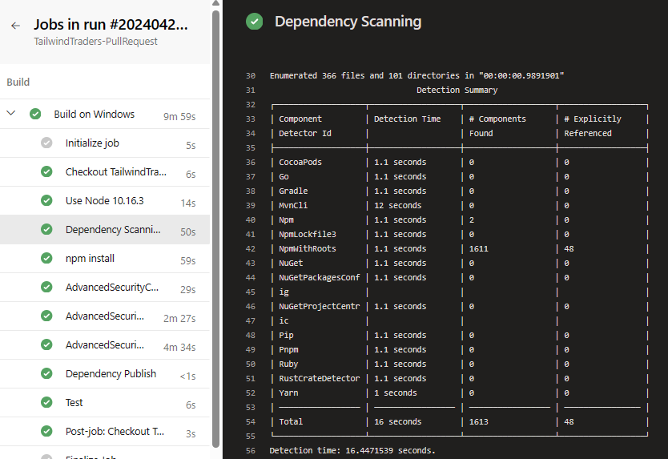

<div class="rw-ui-container"></div>
<a name="Dependency Scanning"></a>

<a name="Ex0Task1"></a>
## Prerequisites ##
In this exercise, you will set up the **Tailwind Traders** project in Azure DevOps to explore the features on GitHub Advanced Security for Azure DevOps (GHAzDO). Complete the following steps to set up the Tailwind Traders project in Azure DevOps from [prerequisites](../prereq-ghas/readme.md).


### Task 1: Dependency Scanning Overview ###

Dependency Scanning scans your project's dependencies, such as libraries, frameworks, and packages, to identify any known security vulnerabilities or outdated versions that may pose a risk to your application.

### Details about Dependency Scanning ###

### About

Whenever there is a change in the dependency graph of a repository and a pipeline with the dependency scanning task is executed, a new snapshot of the components is stored. The dependency scanning task analyzes the dependencies in various programming languages such as Go, Maven, npm (including Yarn and pnpm), NuGet, Pip, Ruby, and Rust. It generates security alerts based on these dependencies.

### How's this work?

During the execution of a pipeline with the dependency scanning task, a new snapshot of the components is stored when there is a change in the repository's dependency graph. The dependency scanning task analyzes dependencies in various programming languages and generates security alerts. The build log provides a link to each individual alert, allowing for further investigation. Additionally, the build log includes essential details about each detected vulnerability, such as severity level, affected component, vulnerability title, and associated CVE.





## Setup Dependency Scanning

So, now that we learned about Dependency scanning, how do we add this into our project?

1. Select and Edit the pipeline you want add scanning too, ```tailwindtraders-build.yml```

1. Locate the section where the build steps are defined, hint: look for - task: DotNetCoreCLI@2.

1. Add the task Advanced Security Dependency Scanning **(AdvancedSecurity-Dependency-Scanning@1)** directly to your YAML pipeline file.

    ```yaml
    - task: AdvancedSecurity-Dependency-Scanning@1
    - task: AdvancedSecurity-Publish@1
    ```

    <details>
    <summary>Solution</summary>

    ```yaml
    trigger:
    - main

    variables:
    resource-group: "ghazdo-workshops"
    BuildConfiguration: "Release"
    BuildPlatform: "any cpu"
    Parameters.RestoreBuildProjects: "**/*.csproj"
    Parameters.TestProjects: "**/*[Tt]ests/*.csproj"
    webapp_name: tailwind-github-demo
    advancedsecurity.submittoadvancedsecurity: true

    pool:
    vmImage: windows-latest

    stages:
    - stage: 'Build'
    displayName: 'Build'
    jobs:
    - job: 
        displayName: 'Build on Windows'
        steps:
        - task: NodeTool@0
        displayName: 'Use Node 10.16.3'
        inputs:
            versionSpec: 10.16.3

        - task: Npm@1
        displayName: 'npm install'
        inputs:
            workingDir: TailwindTraders.Website/Source/Tailwind.Traders.Web/ClientApp
            verbose: false

        - task: DotNetCoreCLI@2
        displayName: Restore
        inputs:
            command: restore
            projects: '$(Parameters.RestoreBuildProjects)'

        - task: DotNetCoreCLI@2
        displayName: Build
        inputs:
            projects: '$(Parameters.RestoreBuildProjects)'
            arguments: '--configuration $(BuildConfiguration)'

        - task: AdvancedSecurity-Dependency-Scanning@1
        displayName: 'Dependency Scanning'
        
        - task: AdvancedSecurity-Publish@1
        displayName: 'Dependency Publish'
        
        - task: DotNetCoreCLI@2
        displayName: Test
        inputs:
            command: test
            projects: '$(Parameters.TestProjects)'
            arguments: '--configuration $(BuildConfiguration)'
        
    ```

    </details>
1. Click **Save** to save the pipeline configuration file.

5. The build will run automatically, initiating the dependency scanning task and publishing the results to Advanced Security. Please note that this process may take up to 10 minutes to finish.

    


> **ProTip!**: Be sure to add the dependency scanning task following the build steps of a pipeline that builds the code you wish to scan.

> Note: [For more information see **Set up dependency scanning**](https://learn.microsoft.com/en-us/azure/devops/repos/security/configure-github-advanced-security-features?view=azure-devops&tabs=yaml#set-up-dependency-scanning)


## Resolution of Dependency Detections

### Dependency Detection Overview
- Dependency Scanning scans your project's dependencies, such as libraries, frameworks, and packages, to identify any known security vulnerabilities or outdated versions that may pose a risk to your application. This happens in the context of a build using the below task to get a thorough accurate analysis.

    ```yaml 
    - Task: AdvancedSecurity-Dependency-Scanning@1
    ```

<details>
<summary>Details on Build Task</summary>

This task is ensure all the components get resolved during the build.  This is important because we want to ensure we get a thorough accurate analysis.  Once it knows the exact version of the package, a code inventory is taken from build output and compared to GitHub Advisory Database. This is why we recommend running this task in the context of a build.

</details>

### Dependency Scanning Detections
1. Go to the **Repos** tab and click on the **Advanced Security** menu item on the bottom.
2. Click on **Dependencies** to see a list of all the dependencies alerts that have been found.  This includes the **Alert**, **Vulnerable package**, **First detected** date. We can easily clean up the dependencies.

    

### Dependency Scanning Alert Details

1. Click on the item, **_Authorization Bypass Through User-Controlled..._** to see the details about this alert.

2. This includes the **Recommendation**, **Locations** found, **Description**, **Severity**, and the **Date** it was first detected. We can easily clean up the dependencies.

    

3. You can also view the code that triggered the alert and what build detected it.

4. Click on **Detections** to see the different builds that detected this alert.
    
    

- **ProTip!** When a vulnerable component is no longer detected in the latest build for pipelines with the dependency scanning task, the state of the associated alert is automatically changed to Closed. To see these resolved alerts, you can use the **State filter** in the main toolbar and select **Closed**.

### Understanding Dependency Alerts
In your repository, there are two types of dependencies: **direct** and **transitive** (also known as indirect).
- **Direct dependencies**, components in your project.
- **Transitive dependencies**, components used by direct dependencies.

<details>
<summary>Summary of Direct and Transitive Dependencies</summary>
- **Direct dependencies** are components that you have explicitly included in your project.
- **Transitive dependencies** are components that are used by your direct dependencies.

It's important to note that vulnerabilities can exist in both direct and transitive dependencies. Regardless of whether the vulnerability is found in a direct or transitive dependency, your project remains vulnerable. Therefore, it's crucial to address vulnerabilities in all dependencies, regardless of their direct or indirect nature.
</details>

### Fixing Dependency Alerts
You can follow the reccomended steps to manually update dependencies. When a Dependency Alert is created in Azure DevOps Advanced Security, it will contain details about the vulnerability and steps you can take to resolve it.

1. To view the alert, go to the **Azure DevOps Advanced Security dashboard**, scroll down and click on the alert **_MongoDB .NET/C# Driver vulnerable..._**.
    
          

2. Review **Recommendation**, **Location**, **Description**, and **Severity** to understand the vulnerability and how to resolve it.

    > Note: The reccomendation will provide you with the steps to resolve the vulnerability.  For this one, simply update the driver version from **2.11.6** to **2.19.0**. to fix the vulerability.

3. Click on the **Locations** to see the code that triggered the alert.

          

4. From the code editor, click **Edit**.

5. On **line 26**, change the **version** of the **MongoDB.Driver** package to **2.19.0**.

        

6. Click **Commit** to save changes.  Enter **fixalert** for branch name and check **Create a pull request**, then click **Commit** again.

       

    > Note: This step is necessary since the main branch is protected by a pull request pipeline.

7. Once the commit is saved, click **Create** to merge the changes into the main branch.

8. This will run the **tailwindtraders-pullrequests** pipeline, which will validate the changes and run the dependency scanning task.

9. Once the pipeline has completed, click **Approve** and **Complete**.

10. Change Merge Type to **Squash commit** and check box next to branch name, **fixalert**, to merge changes into the main branch.

     

> Note: The build will run automatically, initiating the dependency scanning task and publishing the results to Advanced Security and alert automatically closed.

**ProTip!** Squash Merge is important. If we just commit, the exposed credential will still be in the history. To avoid this, fix code, use a Squash Merge, push it to repo, and you're done!

11. Once the pipeline has completed, **tailwindtraders-build.yml**, go to the **Azure DevOps Advanced Security dashboard** and click on **Dependencies**.

12. You will see that the alert **_MongoDB .NET/C# Driver vulnerable..._** no longer exists, as it is now closed.

**ProTip!** Cleaning these up is not automatic, like GitHub Dependabot. This functionality is not in ADO today, but goodnews, the ADO team has it under active development.  In the meantime, you can use the **_advsec.ps1_** PowerShell Script to accomplish this.

**ProChallenge!** If time permits, setup a PR pipeline to automaticly fail if there are any dependency alerts with severity of **_Critical_**.  Start by using the PowerShell Script **dependencyreview.ps1** to accomplish this.

1. In the folder .azdo, look at the powershell script  **depenencyreview.ps1** and the pipeline **tailwindtraders-dependencyreview**. The pipeline calls the PowerShell Script after the depenency scan runs

<details>
<summary>Solution</summary>
    ```yaml
    - task: AdvancedSecurity-Dependency-Scanning@1
      displayName: 'Dependency Scanning'

    - task: AdvancedSecurity-Publish@1
      displayName: 'Dependency Publish'

    - task: PowerShell@2
      inputs:
        workingDirectory: '$(System.DefaultWorkingDirectory)'
        filePath: '.azdo/dependencyreview.ps1'
        arguments: '-isInBuild $true'
        failOnStderr: true
        pwsh: true
      env:
        SYSTEM_ACCESSTOKEN: $(System.AccessToken)
    ```
</details>

2. Create a new pipeline that points to the **tailwindtraders-dependencyreview**. Azure DevOps always tries to create a azure-pipelines.yml pipeline first. Complete this and try again. 
3. Make sure the pipeline triggers on every pull request.

    >Note: This is a great way to ensure you are using the latest and greatest versions of your dependencies, and also, ensure you are not using any vulnerable versions.

## Congratulations you've made it to the end! &#x1F389;

And with that, you've now concluded **Module 1: Software Composition Analysis**. You can now move on to your next module (in most cases that will be **Module 2: Secret Scanning**).

### References

- [GitHub Advanced Security for Azure DevOps, Dependency scanning](https://learn.microsoft.com/en-us/azure/devops/repos/security/github-advanced-security-dependency-scanning?view=azure-devops)

- [Resolving npm packages](https://learn.microsoft.com/en-us/azure/devops/repos/security/github-advanced-security-dependency-scanning?view=azure-devops#npm)


## Setup Code Scanning

## Setup Secret Scanning