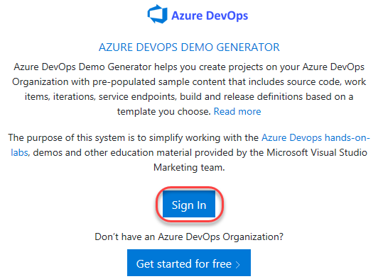

## GitHub Advanced Security ##

GitHub Advanced Security for Azure DevOps brings the same secret scanning, dependency scanning and CodeQL code scanning solutions already available for GitHub users and natively integrates them into Azure DevOps to protect your Azure Repos and Pipelines. These scanning tools will natively embed automated security checks into the Azure DevOps platform, allowing developers to secure their code, secrets and supply chain without leaving their workflow.

This has been designed to help familiarize you with GitHub Advanced Security (GHAS) for Azure DevOps so that you can better understand how to use it in your own repositories.

## Overview ##

GitHub Advanced Security for Azure DevOps adds GitHub Advanced Security's suite of security features to Azure Repos. These capabilities will help developers implement security earlier in the software development lifecycle to find and fix security issues before code is deployed to production. GitHub Advanced Security for Azure includes:

- **Dependency Scanning** – search for known vulnerabilities in open source dependencies (direct and transitive)

- **Secret Scanning** push protection - check if code pushes include commits that expose secrets such as credentials

- **Secret Scanning** repo scanning: scan your repository and look for exposed secrets that were committed accidentally

- **Code Scanning** – use CodeQL static analysis engine to identify code-level application vulnerabilities such as SQL injection and authentication bypass

### Prerequisites ###

- An Azure DevOps account. If you don't have one, you can sign up for free [here](https://azure.microsoft.com/products/devops/).

### Task 1: Configuring the Parts Unlimited team project ###

1. Navigate to [https://azuredevopsdemogenerator.azurewebsites.net](https://azuredevopsdemogenerator.azurewebsites.net/). This utility site will automate the process of creating a new Azure DevOps project within your account that is prepopulated with content (work items, repos, etc.) required for the lab. For more information on the site, please see [https://learn.microsoft.com/azure/devops/demo-gen/?view=azure-devops](https://learn.microsoft.com/azure/devops/demo-gen/?view=azure-devops).

1. Sign in using the Microsoft account associated with your Azure DevOps subscription.

    

1. **Accept** the permission requests for accessing your subscription.

1. Select your Azure DevOps organization and enter the project name **"Tailwind Traders"**. Click **Choose Template** and select Tailwind Traders, then click **Select Template**.

    

1. Enter the new project name and click on **Create Project**. Wait for the process to complete.

    

### Task 2: Enable the GitHub Advanced Security from portal ###

 GitHub Advanced Security for Azure DevOps includes extra permissions for more levels of control around Advanced Security results and management. Be sure to adjust individual permissions for your repository. To ensure Azure DevOps Advanced Security is enabled in your organization, you can follow these steps.

1. Sign in to your Azure DevOps account with appropriate permissions to access organization settings

1. Navigate to the Azure DevOps organization and Team Project you want to check.

1. In the lower-left corner, click on **Project settings**

1. In the left-menu area under **Repos**, click **Repositories**.

1. Click on the **TailwindTraders** repository.

1. Click on **Settings**, then click **Advanced Security**, On to turn it on.

1. Click **Begin Billing**.

1. **Advanced Security** and **Push Protection** is now enabled.

    

### Task 3: Setup Advanced Security permissions ###

1. Select **Security**, under **Azure DevOps Groups**, click on **Project Administrators**.
2. Next to **Advanced Security: manage and dismiss alerts**, click the dropdown and select **Allow**.
3. Next to **Advanced Security: manage settings**, click the dropdown and select **Allow**.
4. Next to **Advanced Security: view alerts**, click the dropdown and select **Allow**.
5. If successful, a green checkmark &#x2705; appears next to the selected permission.

    

### Task 4: Setup Branch Protection ###

Using Branch Policies for pre-merge checks is considered a best practice for developers because it helps ensure code quality, collaboration, and a controlled workflow.  Let's setup a branch policy for the **main** branch with a build validation rule.

1. Click **Policies**, under **Branch Policies**, click **master**.

    

2. Under **Build Validation**, click **+** to **Add new build policy**.
    
    

3. Click the **Build pipeline** dropdown and select **TailwindTraders-PullRequest**, click **Save**.
    
    

4. The build validation policy is now set up for the **master** branch.

### Task 5: Dependency Scanning Overview ###

Dependency Scanning scans your project's dependencies, such as libraries, frameworks, and packages, to identify any known security vulnerabilities or outdated versions that may pose a risk to your application.

### Details about Dependency Scanning ###

### About

Whenever there is a change in the dependency graph of a repository and a pipeline with the dependency scanning task is executed, a new snapshot of the components is stored. The dependency scanning task analyzes the dependencies in various programming languages such as Go, Maven, npm (including Yarn and pnpm), NuGet, Pip, Ruby, and Rust. It generates security alerts based on these dependencies.

### How's this work?

During the execution of a pipeline with the dependency scanning task, a new snapshot of the components is stored when there is a change in the repository's dependency graph. The dependency scanning task analyzes dependencies in various programming languages and generates security alerts. The build log provides a link to each individual alert, allowing for further investigation. Additionally, the build log includes essential details about each detected vulnerability, such as severity level, affected component, vulnerability title, and associated CVE.

## Setup Dependency Scanning

So, now that we learned about Dependency scanning, how do we add this into our project?

