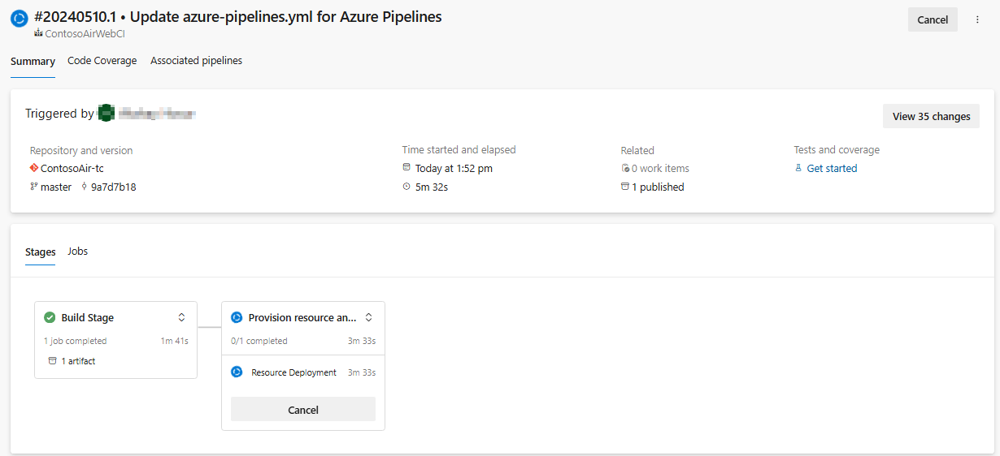
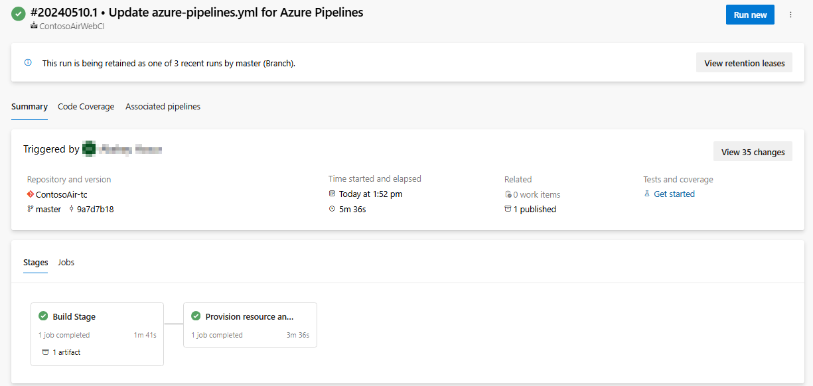

## Overview

In this lab you will learn how deploy Node Js application to Azure App Service using Azure DevOps.

Node.js is a runtime environment that allows you to run JavaScript code on the server-side. It is built on Chrome's V8 JavaScript engine and provides an event-driven, non-blocking I/O model that makes it lightweight and efficient.

### What's covered in this lab

This lab will show how you will 

- Provision the resources using ARM templates.
- Configuring the Azure DevOps pipeline to deploy a Node Js application to Azure App Service using Azure DevOps.

### Before you begin

1. Refer the [Getting Started](../Setup/) page before you follow the exercises.

1. Use **Contoso Air** as a template to provision the new Azure DevOps project using the [Azure DevOps Demo Generator](https://azuredevopsdemogenerator.azurewebsites.net/?Name=ContosoAir){:target="\_blank"}.

## Exercise 1: Creating ARM service connection

In this exercise, you will create a service connection to Azure Resource Manager to deploy the resources using ARM templates.

> Azure Resource Manager (ARM) is the deployment and management service for Azure. It provides a management layer that enables you to create, update, and delete resources in your Azure account.

1. Navigate to the Azure DevOps project created using the [Azure DevOps Demo Generator](https://azuredevopsdemogenerator.azurewebsites.net/?Name=ContosoAir){:target="\_blank"}.

1. Click on **Project settings**.
1. Under **Pipelines**, click on **Service connections**.
1. Click on **New service connection** and select **Azure Resource Manager**.

    

1. Click on **Service principal (Automatic)** and select **Next**

    

1. Select the Azure subscription from the drop-down and provide name for Service connection **ContosoAir**. Same connection name will be used in the pipeline. Click on **Save** to create the service connection.

    

1. Open the service connection created, from the right top corner click on ellipse to configure the pipeline security.

    

1. Under the **Pipelines permissions** select the pipeline **ContosoAirWebCI**.

    

> This pipelines requires the variables to be passed as a parameters to ARM deployment, that will be configured automatically while provisioning the pipeline.

### Variables used

| Name | Value |
| --- | --- |
| site_name | contoso-air |
| web | {DYNAMICALY_GENERATED_VALUE} |

Run the pipeline to provision the resources using ARM templates and deploy the Node Js application to Azure App Service.

## Exercise 2: Configuring the Azure DevOps pipeline

1. Naviget to Pipelines and select the pipeline **ContosoAirWebCI** and **Edit** the pipeline.

    

1. Scroll down to **AzureResourceManagerTemplateDeployment** and click on the setting to open the task assistant. 

1. Update the Service connection details using the Task assistant, click on **Validate and Save** and **Save**, commit directly to the master branch to save the pipeline.

    

1. Once you commit on to the master branch, the pipeline will be triggered automatically.

    

1. Once the pipeline is completed, navigate to the Azure portal and verify the resources provisioned.

    

1. Navigate to the **Provision Resource and Deploy** stage and click on **AzureRMWebDeployment** task to view the application URL.
    
    

1. Click on the application URL to see the application running.

    