

## Overview

In this lab, you will learn how you can use Azure Pipelines to deploy a Java web application to [Apache Tomcat](http://tomcat.apache.org/){:target="\_blank"} with a MySQL database on Azure. Apache Tomcat is an open-source Java Servlet Container developed by the Apache Software Foundation (ASF). MySQL is a very popular open-source relational database management system.

For this lab, you will use Azure App Service and Azure Database for MySQL, a relational database service based on the open source MySQL Server engine. It is a fully managed database as a service, capable of handing mission-critical workload with predictable performance and dynamic scalability.

Want additional learning? Check out the <a href="https://docs.microsoft.com/en-us/learn/modules/deploy-java-containers/" target="_blank"><b><u> Automate Java container deployments </u></b></a> module on Microsoft Learn.

### What's covered in this lab

This lab will show how you will

- Create a new Azure App Service with a MySQL database server and configure the web app to use Apache Tomcat
- Use Azure App Service Task to deploy a WAR file

### Before you begin

1. Refer the [Getting Started](../Setup/) page before you follow the exercises.

1. Use **MyShuttle** as a template to provision the new Azure DevOps project using the [Azure DevOps Demo Generator](https://azuredevopsdemogenerator.azurewebsites.net/?TemplateId=77371&Name=MyShuttle){:target="\_blank"}.

## Exercise 1: Creating Azure Web App and MySQL database

1. Launch the [Azure Cloud Shell](https://docs.microsoft.com/en-in/azure/cloud-shell/overview) from the portal.  To deploy to a resource group, enter the following command

    <code style="color:black;">
    az group create --name MyResourceGroup  --location westus</code>

1. To create an App service plan

     <code style="color:black;">
    az appservice plan create --resource-group MyResourceGroup --name MyPlan --sku S1</code>

1. Create the web app with a unique app name

    <code style="color:black;">
    az webapp create --resource-group MyResourceGroup --plan MyPlan --name MyUniqueAppName
   </code>

1. Finally, create the MySQL server with a unique server name.

    <code style="color:black;">
    az mysql server create --resource-group MyResourceGroup --name mysqldbserver --admin-user mysqldbuser --admin-password P2ssw0rd@123 --sku-name GP_Gen5_2
    </code>

     
1. Navigate to the resource group that you have created. You should see a **Azure Database for MySQL server** provisioned. Select the database server.

   

1. Select **Properties**. Save the **Server name** and **Server admin login name** to a notepad.

   

   In this example, the server name is **myshuttle-1-mysqldbserver.mysql.database.azure.com** and the admin user name is **mysqldbuser@myshuttle-1-mysqldbserver**. 

1. Select **Connection security**. Enable **Allow access to Azure services** toggle and **Save** the changes. This provides access to Azure services for  all the databases in your MySQL server.
       
    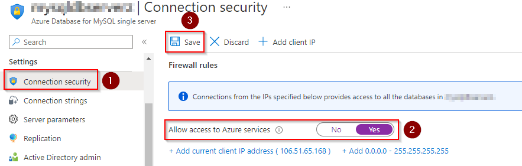
       
## Exercise 2: Updating the App Settings for the Web App

Next, navigate to the Web app that you have created. As you are deploying a Java application, you need to change the web app’s web container to Apache Tomcat. 

1. Select **Configuration**. Set the **Stack settings** as shown in below image and click **Save**.

    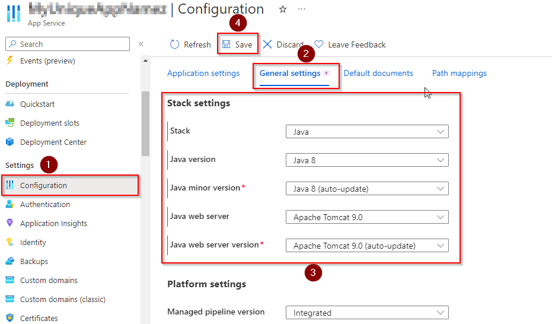

1. Select **Overview** and click **Browse**.

     

    The web page will look like the below image.

   

   Next, you need to update the **connection strings** for the web app to connect to the database correctly. There are multiple ways you can do this - but for the purpose of this lab, you will take a simple approach by updating it directly on the Azure portal.

1. From the Azure portal, select the Web app you provisioned. Go to **Configuration \| Application settings \| Connection strings** and click on **+ New connection string**.

     

1. In **Add/Edit connection string** window, add a new **MySQL** connection string with **MyShuttleDb** as the name, paste the following string for the value and replace **MySQL Server Name**, **your user name** and **your password** with the appropriate values. Click **Update**.

   > <code style="color:black;">jdbc:mysql://{MySQL Server Name}:3306/alm?useSSL=true&requireSSL=false&autoReconnect=true&user={your user name}&password={your password}</code>

   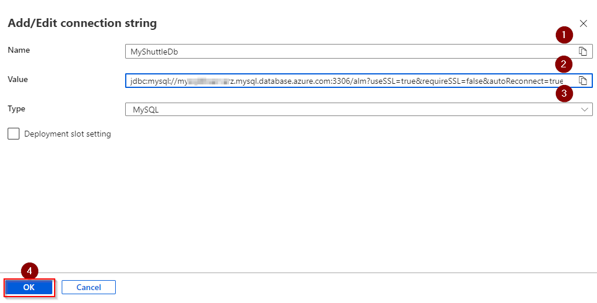

   - MySQL Server Name : Value that you copied previously from the MySQL server Properties.
   - your user name : Value that you copied previously from the MySQL server Properties.
   - your password : Value that you provided during the creation of MySQL database server.

1. Click on **Save** to save the connection string.

   > 

   <code style="color:black;">
   String conStr = System.getenv("MYSQLCONNSTR_MyShuttleDb");
   </code>

You have now setup and configured all the resources that is needed to deploy and run the MyShuttle application.

## Exercise 3: Create service connection

1. Select **Project settings** and click on **Service connections** under **Pipelines**. Click on **New service connection** and select **Azure Resource Manager**, select **Next** to choose the **Authentication Method**.

   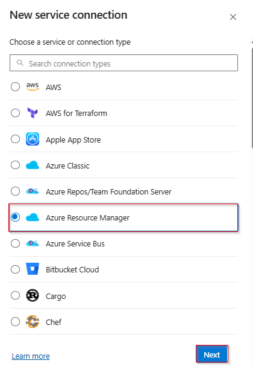

1. Select **Service principal (automatic)** and click on **Next**.
   
   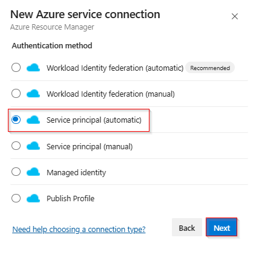

1. Select the appropriate **Subscription**, **Resource Group** and provide the Serviec connection name **MyShuttleConnection** . Click on **Save** to create the service connection.
   
   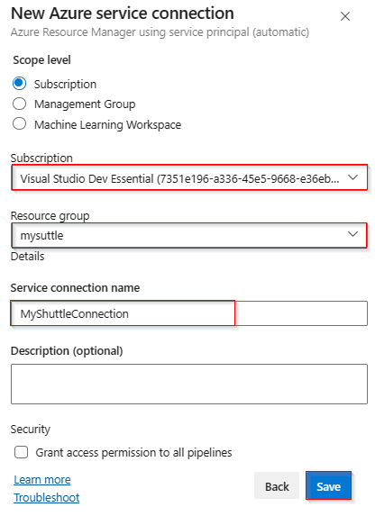
   
      

1. Click on the service connection created, select the **Security** menu to add pipeline permission to use the service connection.

   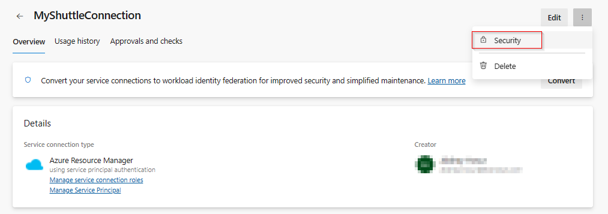

1. Click on **+** to add the pipeline to the service connection. Choose **myshuttle-YAML**.

   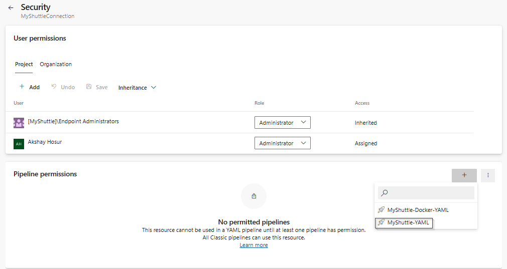

## Exercise 4: Update the pipeline variables

1. Once the build succeeds, select **Edit pipeline** button ellipse.

   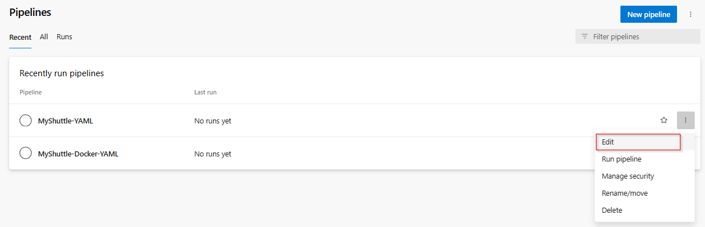

1. Scroll down to **Deploy** stage. 
**MySQL database deploy** and Azure **App Service deploy** expecting few parameters to be passed. Add the following details in the variable section and save the variables.

   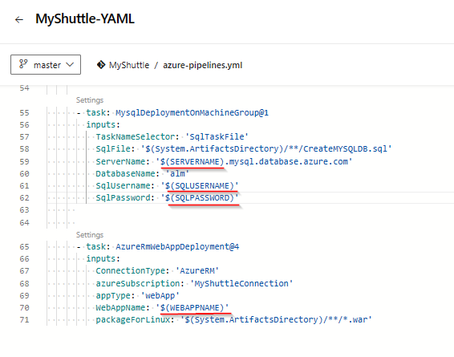

   - **SERVERNAME** : The MySQL server name that you noted down previously.
   - **SQLUSERNAME** : The MySQL server admin login name that you noted down previously.
   - **SQLPASSWORD** : The password that you created during the creation of MySQL server in the Azure portal.
   - **WEBAPPNAME** : The name of the web app that you created.

   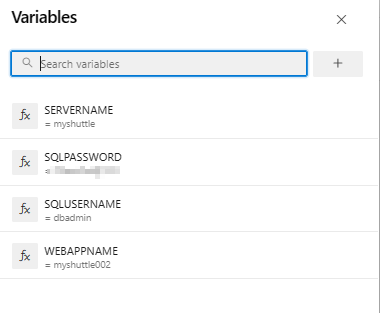

1. Make sure that the **Azure Subscription** is selected correctly.

   

1. Click on **Validate and save** pipeline.

## Exercise 5: Deploy the changes to Web App

1. Select **Pipelines \| Pipelines**. Choose the pipeline **MyShuttle-YAML** and click **Run pipeline** to trigger the build and wait for the build to complete.

   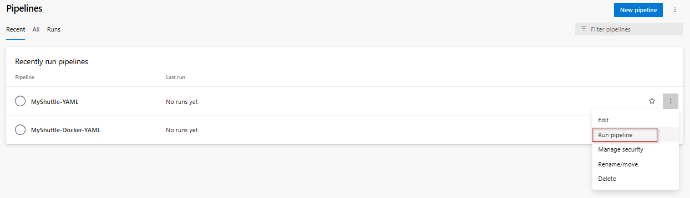

1. Click on the **Run** button to start the build.
   To view the detailed logs, enable the check box **Enable system diagnostics**.

   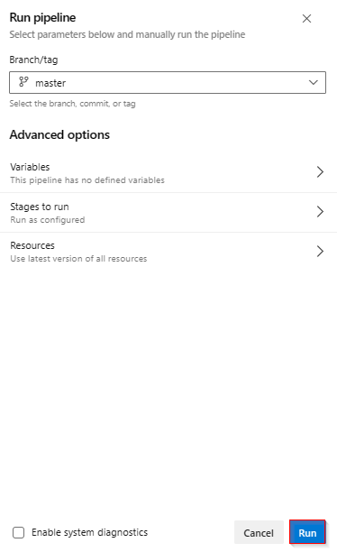

1. Build stage will be running. Click on the **Stage** to view the detailed logs.

   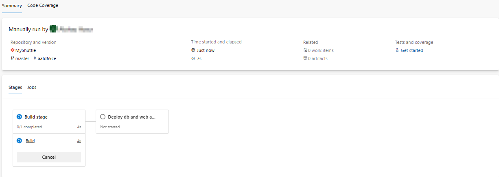

   > The lab uses the standard **Maven** build template to compile the code, copy and publish the resulting artifacts for deployment. An additional file which is copied here is the `CreateMYSQLDB.sql` file which creates a MySQL database and inserts a few records into it during the deployment.

1. Wait for the release to complete. Then navigate to the Web App and select the **URL** from the overview blade. Add **/myshuttledev** context to the URL. For instance - [http://myshuttle1.azurewebsites.net/myshuttledev](http://myshuttle1.azurewebsites.net/myshuttledev){:target="\_blank"}

   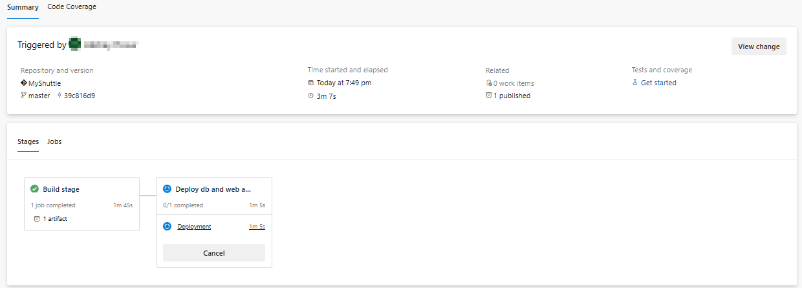

1. The MyShuttle application will be displayed.
   
      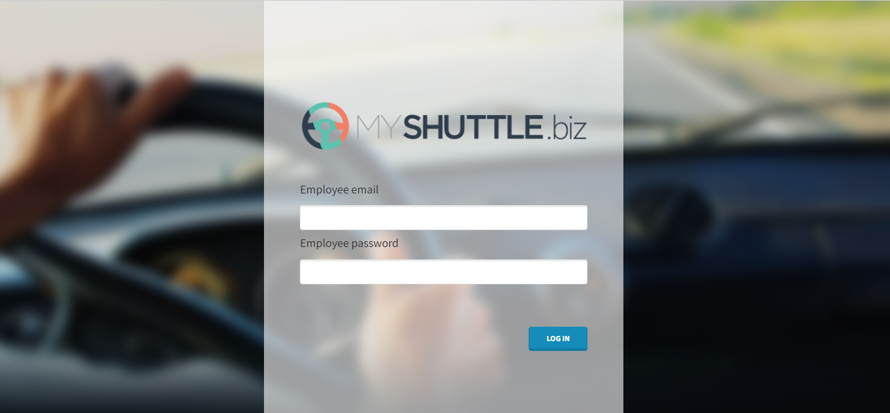

1. Select **Login** and try logging in to the site with any one of the following credentials.

   | Username | Password       |
   | -------- | -------------- |
   | barney   | barneypassword |
   | fred     | fredpassword   |

1. If your database was setup correctly and the connection parameters are valid, you should be able to login to the portal.

   

   

## Summary

In this lab, you have learnt how to deploy a Tomcat based Java application with MySQL database on Azure with Azure Pipelines.
